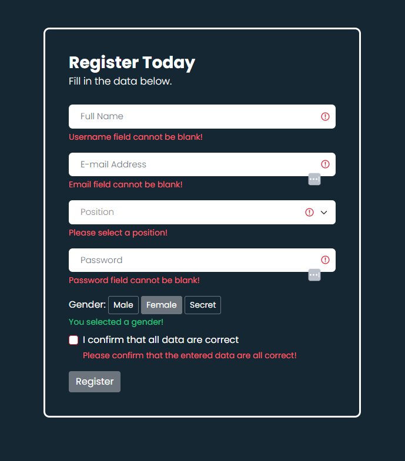
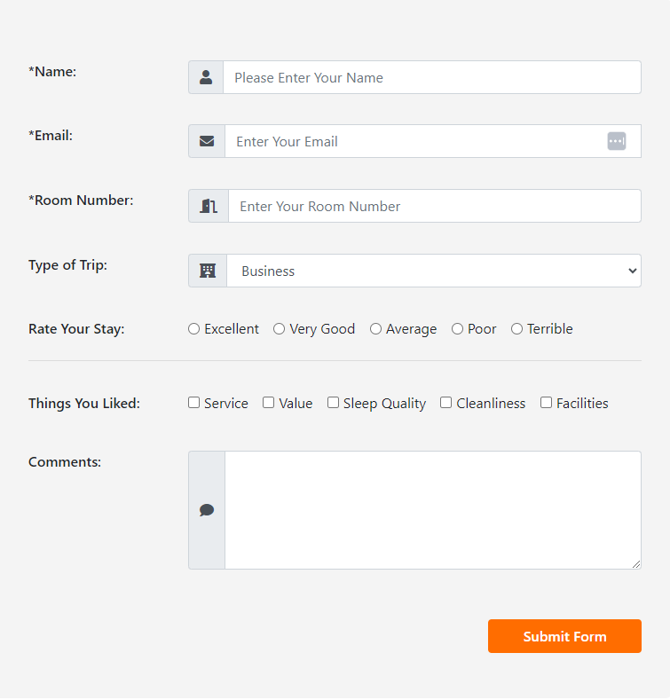
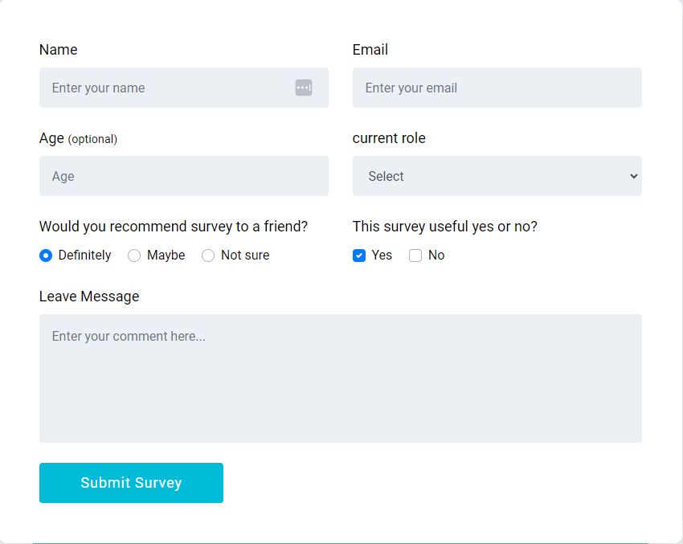
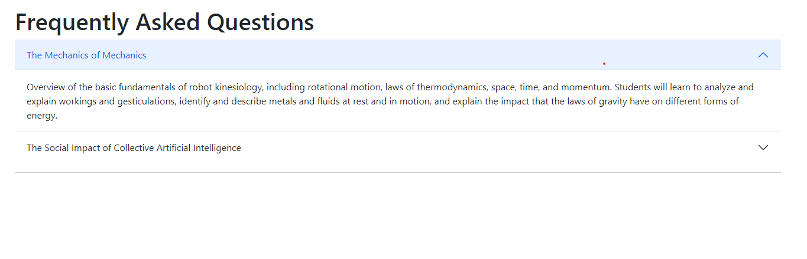
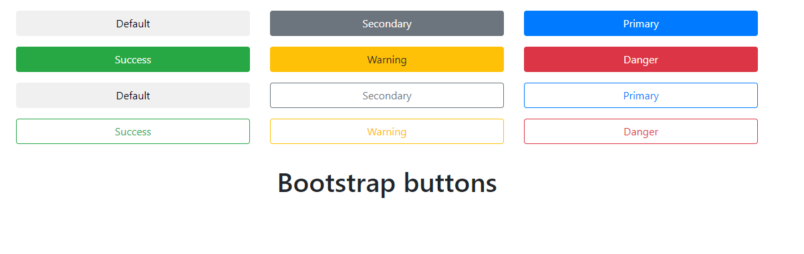
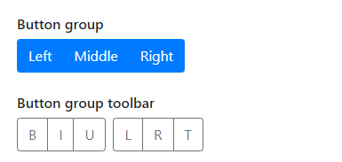
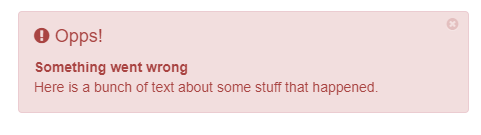

# Learn Bootstrap in 30 Chapters

### After completing this course, we'll build [5 Projects]() with Bootstrap in-sha-Allah.

After completing the 30-chapters module, jump in the [Projects Section](#).

|                                     **Chapter No.**                                      |                                                                           **Topics**                                                                           | **Video Explanation** |
| :--------------------------------------------------------------------------------------: | :------------------------------------------------------------------------------------------------------------------------------------------------------------: | :-------------------: |
|                       [00](#chapter-00-how-the-course-is-designed)                       |                                              [How The Course is Designed](#chapter-00-how-the-course-is-designed)                                              |       Watch Now       |
|                   [01](#chapter-01-install-breakpoints-container-grid)                   |                                    [Install, Breakpoints, Container, Grid](#chapter-01-install-breakpoints-container-grid)                                     |       Watch Now       |
|                        [02](#chapter-02-columns-gutters-css-grid)                        |                                                  [Columns and Gutters](#chapter-02-columns-gutters-css-grid)                                                   |       Watch Now       |
|                [03](#chapter-03-reboot-typography-images-tables-figures)                 |                               [Reboot, Typography, Images, Tables, Figures](#chapter-03-reboot-typography-images-tables-figures)                               |       Watch Now       |
|                             [04](#chapter-04-bootstrap-form)                             |                                                          [Bootstrap Form](#chapter-04-bootstrap-form)                                                          |     [Watch Now]()     |
| [05](#chapter-05-bootstrap-accordion-alerts-badges-breadcrumbs-buttons-and-button-group) |  [Bootstrap Accordion, Alerts, Badges, Breadcrumb, Buttons, Button Group](#chapter-05-bootstrap-accordion-alerts-badges-breadcrumbs-buttons-and-button-group)  |     [Watch Now]()     |
| [06](#chapter-06-bootstrap-card-carousel-close-button-collapse-dropdown-and-list-group)  | [Bootstrap Card, Carousel, Close Button, Collapse, Dropdown and List Group](#chapter-06-bootstrap-card-carousel-close-button-collapse-dropdown-and-list-group) |     [Watch Now]()     |
|                                            07                                            |                                                                                                                                                                |                       |
|                                            08                                            |                                                                                                                                                                |                       |
|                                            09                                            |                                                                                                                                                                |                       |
|                                            10                                            |                                                                                                                                                                |                       |
|                                            11                                            |                                                                                                                                                                |                       |
|                                            12                                            |                                                                                                                                                                |                       |
|                                            13                                            |                                                                                                                                                                |                       |
|                                            14                                            |                                                                                                                                                                |                       |
|                                            15                                            |                                                                                                                                                                |                       |
|                                            16                                            |                                                                                                                                                                |                       |
|                                            17                                            |                                                                                                                                                                |                       |
|                                            18                                            |                                                                                                                                                                |                       |
|                                            19                                            |                                                                                                                                                                |                       |
|                                            20                                            |                                                                                                                                                                |                       |
|                                            21                                            |                                                                                                                                                                |                       |
|                                            22                                            |                                                                                                                                                                |                       |
|                                            23                                            |                                                                                                                                                                |                       |
|                                            24                                            |                                                                                                                                                                |                       |
|                                            25                                            |                                                                                                                                                                |                       |
|                                            26                                            |                                                                                                                                                                |                       |
|                                            27                                            |                                                                                                                                                                |                       |
|                                            28                                            |                                                                                                                                                                |                       |
|                                            29                                            |                                                                                                                                                                |                       |
|                                            30                                            |                                                                                                                                                                |                       |

# 5 Bootstrap Projects

| **Project No.** | **Project Name** | **Video Explanation** | **Live Demo** |
| :-------------: | :--------------: | :-------------------: | :-----------: |
|       01        |                  |       Watch Now       |   Live Link   |
|       02        |                  |                       |               |
|       03        |                  |                       |               |
|       04        |                  |                       |               |
|       05        |                  |                       |               |

# Chapter-00: How The Course is Designed

- [কোর্সটি কাদের জন্য?](#কোর্সটি-কাদের-জন্য)
- [Prerequisite](#prerequisite)
- [কোর্সটি যেভাবে সাজানো হয়েছে](#কোর্সটি-যেভাবে-সাজানো-হয়েছেঃ)

### কোর্সটি কাদের জন্য?

- এই কোর্সটিতে যেকেউ অংশগ্রহণ করতে পারবে। শিখার জন্য মনের ইচ্ছাটাই আসল!
- Course টি মূলত Beginner-friendly. যারা Web Programming এ নতুন তাদেরকে উদ্দেশ্য করেই Course টি সাজানো।

### Prerequisite

- HTML ও CSS

### কোর্সটি যেভাবে সাজানো হয়েছেঃ

- এই পুরো Article কে একটা বই মনে করতে পারো। কোর্সটি 30 টি Chapter এ ভাগ করা হয়েছে। প্রতিটি Chapter এ Bootstrap এর বিভিন্ন Topics নিয়ে আলোচনা করা হয়েছে।
- প্রতিটা Chapter এর Module সাজানো হয়েছে ক্রমানুসারে । উদাহরণস্বরূপ, Chapter-05 এর টপিকসগুলো শিখতে হলে অবশ্যই তোমাকে Chapter-04 শেষ করে আসতে হবে। একইভাবে Chapter-04 শিখতে হলে তোমাকে Chapter-03 শেষ করে আসতে হবে ।
- প্রতিটা Chapter এর Topics এর Written Explanation/Article এর সাথে সাথে Video Explanation-ও দেয়া আছে। যাতে শিক্ষার্থীরা খুব সহজেই টপিকসগুলো আত্মস্থ করতে পারে।

**Course Design**

Bootstrap এর পুরো Course টিকে ৬ টি ভাগে ভাগ করা হয়েছে। নিচে Course Design টা Table আঁকারে দেয়া হলো।

| **Part**      | **Topics**                                                                                                                                                                                                                                  |
| ------------- | ------------------------------------------------------------------------------------------------------------------------------------------------------------------------------------------------------------------------------------------- |
| 1. Layout     | Breakpoints, Containers, Grid, Columns, Gutters, Utilities, Z-index, CSS Grid                                                                                                                                                               |
| 2. Content    | Reboot, Typography, Images, Tables, Figures                                                                                                                                                                                                 |
| 3. Forms      | Form Controls, Select, Checks & Radios, Ranges, Input Groups, Floating Labels, Layout, Validation                                                                                                                                           |
| 4. Components | Accordion, Alerts, Badge, Breadcrumb, Buttons, Card, Carousel, Close Buttons, Collapse, Dropdowns, List Group, Modals, Navbar, Navs & Tabs, Off Canvas, Pagination, Placeholders, Popovers, Progress, Scrollspy, Spinners, Toasts, Tooltips |
| 5. Helpers    | Clearfix, Color & Background, Colored links, Focus ring, Icon link, Position, Ratio, Stacks, Stretched link, Text truncation, Vertical Rule, Visual hidden                                                                                  |
| 6. Utilities  | API, Background, Borders, Colors, Display, Flex, Float, Interaction, Link, Object fit, Opacity, Overflow, Position, Shadows, Sizing, Spacing, Text, Vertical Align, Visibility, Z-index                                                     |

# Chapter-01: Install, Breakpoints, Container, Grid

- [What is Bootstrap?](#what-is-bootstrap)
- [Why Use Bootstrap?](#why-use-bootstrap)
- [Installation Method](#installation-method)
  - [Way-01](#way-01)
  - [Way-02](#way-02)
- [Breakpoints]()

### What is Bootstrap?

Bootstrap হলো একটি front-end framework যার মাধ্যমে খুব সহজে Mobile-first এবং Responsive web design করা যায়।

### Why Use Bootstrap?

- Mobile-first approach: অর্থাৎ Design করার ক্ষেত্রে এই Framework মোবাইল এর কথা আগে চিন্তা করে।
- Responsive Design: Responsive Web Design করার জন্য Bootstrap খুবই কার্যকরী, বলা যেতে পারে Bootstrap এর প্রধান Feature-ই হলো Responsive Design করা।
- Time Saving: মাথায় কোন Prototype বা Design idea আছে? Bootstrap দিয়ে খুব সহজেই Prototype থেকে Design করে ফেলা যায়, যা Developers দের অনেক সময় বাঁচিয়ে দেয়।

### Installation Method

Bootstrap আমরা কয়েকভাবে ব্যবহার করতে পারি। নিচে Bootstrap ব্যবহার করার কয়েকটি উপায় আলোচনা করা হলোঃ

#### Way-01

#### Way-02

### Breakpoints

- Breakpoints হলো responsive design এর building blocks.

#### Available Breakpoints

    <b><a href="#learn-bootstrap-in-30-chapters">↥ Go to Top</a></b>

# Chapter-02: Columns, Gutters, CSS Grid

# Chapter-03: Reboot, Typography, Images, Tables, Figures

- [What is Reboot Concept in Bootstrap?](#what-is-reboot-concept-in-bootstrap)
  - [By Default কি কি Reboot করা হলো?](#by-default-কি-কি-reboot-করা-হলো)
  - [Heading এ যা Reboot করা হলো](#heading-এ-যা-reboot-করা-হলো)
  - [Paragraph এ যা Reboot করা হলো](#paragraph-এ-যা-reboot-করা-হলো)
  - [Link এ যা Reboot করা হলো](#link-এ-যা-reboot-করা-হলো)
- [Typography]

### What is Reboot Concept in Bootstrap?

- Bootstrap অনেক HTML Elements এর By default আচরণকে কিছুটা নিজেদের মত করে পরিবর্তন করে দিয়েছে। এই Concept টাকেই Reboot বলা হচ্ছে।
- শুধু HTML ফাইলে Element টা ব্যবহার করলেই আমরা সেই পরিবর্তনগুলো দেখতে পাবো, এরজন্য অতিরিক্ত কোন Class ব্যবহার করতে হবে না। তবে আমরা চাইলে Bootstrap এর Class ব্যবহার করে নিজেদের মত Style করতেই পারি!

যেমন, সব Heading Elements (`<h1>`, `<h2>`, `<h3>`, `<h4>`, `<h5>`, `<h6>`) থেকে `margin-top` removed করে দেয়া হয়েছে।

#### By Default কি কি Reboot করা হলো?

- `box-sizing: border-box` এইটা প্রত্যেকটা element এবং তাদের `*::before` এবং `*::after` এ সেট করে দেয়া হয়েছে।
- `<html>` element এ কোন base `font-size` দেয়া হয়নি। base font size সাধারণত 16px থাকে (browser default).
- Body তে `font-size: 1rem` সেট করা থাকে। অর্থাৎ যদি html element এ base font-size যদি 16px হয়, তাহলে body তেও সেই 16px থেকে যায়।
- Body তে globally একটা `font-family`, `font-weight`, `line-height`, `background-color` (`#fff`) এবং `color` সেট করা হয়।
- সবচেয়ে মজার যে বিষয় তা হলো Bootstrap ভিন্ন ভিন্ন Devices এবং OS এ ভিন্ন ভিন্ন `font-family` set করে। যেমন, macOS এবং iOS এর ক্ষেত্রে `-apple-system`, windows এর ক্ষেত্রে `Segoe UI`, Android এর ক্ষেত্রে `Roboto`, Linux এর ক্ষেত্রে `Noto Sans` ব্যবহার করা হয়, এর সাথে সাথে কিছু fallback font-ও ব্যবহার করা হয়।
  তারমানে বুঝা গেলো একজন Developer Code শুরু করার আগেই Bootstrap smartly তারহয়ে অনেক কিছু Reset করে দেয়!

#### Heading এ যা Reboot করা হলো

- `margin-top` removed.
- `margin-bottom: 0.5rem` সেট করা হয়েছে।

#### Paragraph এ যা Reboot করা হলো

- `margin-top` removed.
- `margin-bottom: 1rem` সেট করা হয়েছে।

#### Link এ যা Reboot করা হলো

- link এ Underline সহ একটা color থাকে।
- link `visited` হলে এর color পরিবর্তন হবে না।

#### Horizontal Rules এ যা Reboot করা হলো

- `opacity: 0.25` সেট করা থাকে।
- `border-color` এর কালার `color` এর মাধ্যমে Inherit করে। অর্থাৎ `
` এর Parent এর text color যদি green হয়, তাহলে `
` এর border color-ও green হবে।

#### Lists এ যা Reboot করা হলো

- `margin-top` removed.
- `margin-bottom: 1rem` সেট করা হয়েছে।
- Nested lists এর কোন `margin-bottom` নেই।

#### `<code>` এবং `<pre>` তে যা Reboot করা হলো

#### Variables এ যা Reboot করা হলো

#### User Input এ যা Reboot করা হলো

#### Sample Output এ যা Reboot করা হলো

#### Tables এ যা Reboot করা হলো

#### Forms এ যা Reboot করা হলো

- `<fieldset>` থেকে border, margin এবং padding removed করা হয়েছে।
- `<label>` কে `display: inline-block` করা হয়েছে যাতে margin ব্যবহার করা যায়।
- `<input>`, `<select>`, `<textarea>` এবং `<button>` একটা Basic Style দেয়া হয়েছে।
- Button Element এ `cursor: pointer` সেট করে দেয়া হয়েছে।

#### Address Element এ যা Reboot করা হলো

#### Blockquote এ যা Reboot করা হলো

#### `<abbr>` Element এ যা Reboot করা হলো

#### Summary Element এ যা Reboot করা হলো

#### Hidden Attribute এ যা Reboot করা হলো

# Chapter-04: Bootstrap Form

- [Form Control]()
- [Select]()
- [Checks and Radios]()
- [Range]()
- [Input Group]()
- [Floating Labels]()
- [Layout]()
- [Validation]()
- [Assignments]()

## Form Control

## Select

## Checks and Radios

## Range

## Input Group

## Layout

## Validation

## Assignments

### Problem-01

### Problem-02

### Problem-03

# Chapter-05: Bootstrap Accordion, Alerts, Badges, Breadcrumbs, Buttons and Button Group

- [Accordion](#bootstrap-accordion)
- [Alerts](#bootstrap-alerts)
- [Badges](#bootstrap-badge)
- [Breadcrumbs](#bootstrap-breadcrumbs)
- [Button](#bootstrap-button)
- [Button Group](#bootstrap-button-group)
- [Assignments for Chapter 5](#assignments-for-chapter-5)
  - [Assignment 1](#assignments-1-for-chapter-5)
  - [Assignment 2](#assignments-2-for-chapter-5)
  - [Assignment 3](#assignments-3-for-chapter-5)
  - [Assignment 4](#assignments-4-for-chapter-5)

## Bootstrap Accordion

- Bootstrap দিয়ে Accordion তৈরি করতে যে যে Classes এবং Attributes লাগে তা নিচে দেয়া হলোঃ

## Bootstrap Alerts

- Bootstrap দিয়ে Alerts তৈরি করতে যে যে Classes এবং Attributes লাগে তা নিচে দেয়া হলোঃ

| No. | Class              | Attribute       | Reason                                                                                                 |
| --- | ------------------ | --------------- | ------------------------------------------------------------------------------------------------------ |
| 1   | alert              |                 | alert তৈরি করার জন্য।                                                                                  |
| 2   | alert-primary      |                 | alert এর Color দেয়ার জন্য।                                                                             |
| 3   |                    | role            | alert টা কি Role play করছে সেটা বলে দেয়ার জন্য।                                                        |
| 4   | btn-close          |                 | Button টা কি Type এর Button, সেটা বলে দেয়ার জন্য।                                                      |
| 5   |                    | data-bs-dismiss | Close Button টাকে Workable করার জন্য।                                                                  |
| 6   | alert-dismissiable |                 | Close Button টা ডান পাশে নেবার জন্য।                                                                   |
| 7   | fade and show      |                 | Alert টা Smoothly চলে যায়, সেজন্য এই দুইটা ক্লাস একসাথে ব্যবহার করতে হয়।                               |
| 8   | alert-link         |                 | Alert এর মধ্যে যদি আমরা কোন লিংক ব্যবহার করতে চাই, সেই লিংকটা যেন Alert এর Color কে Follow করে সেজন্য। |

## Bootstrap Badge

## Bootstrap Breadcrumb

- Bootstrap দিয়ে Breadcrumb তৈরি করতে যে যে Classes এবং Attributes লাগে তা নিচে দেয়া হলোঃ

| **No.** | **Class**       | **Attribute** | **Reason**                         |
| ------- | --------------- | ------------- | ---------------------------------- |
| 1       | breadcrumb      |               | breadcrumb তৈরি করার জন্য।         |
| 2       | breadcrumb-item |               | breadcrumb এর Item তৈরি করার জন্য। |
| 3       | active          |               | Active Page এর জন্য।               |

## Bootstrap Button

- Bootstrap দিয়ে Button তৈরি করতে যে যে Classes এবং Attributes লাগে তা নিচে দেয়া হলোঃ

| **No.** | **Class**           | **Attribute**  | **Reason**                                                                                                                                          |
| ------- | ------------------- | -------------- | --------------------------------------------------------------------------------------------------------------------------------------------------- |
| 1       | btn                 |                | Bootstrap Button তৈরি করার জন্য।                                                                                                                    |
| 2       |                     | type           | Element টা যে একটা Button Type সেটা বলে দেয়ার জন্য।                                                                                                 |
| 3       | btn-primary         |                | Button এর কালার দেয়ার জন্য।                                                                                                                         |
| 4       | btn-outline-primary |                | Outline Button তৈরি করার জন্য।                                                                                                                      |
| 5       | btn-lg              |                | Large Button তৈরি করার জন্য।                                                                                                                        |
| 6       | btn-sm              |                | Small Button তৈরি করার জন্য।                                                                                                                        |
| 7       |                     | role           | আমরা Button ছাড়াও অন্য elements যেমন `<a>` এবং `<input>` কে অনেক সময় Button হিসেবে ব্যবহার করতে পারি। সেজন্য Role Attribute এ Button Value দিতে হয়। |
| 8       |                     | disabled       | Button কে Disabled করার জন্য।                                                                                                                       |
| 9       |                     | data-bs-toggle | Button এ Toggle Mode দেয়ার জন্য।                                                                                                                    |

## Bootstrap Button Group

- Bootstrap দিয়ে Button Group তৈরি করতে যে যে Classes এবং Attributes লাগে তা নিচে দেয়া হলোঃ

| **No.** | **Class**          | **Attribute** | **Reason**                                      |
| ------- | ------------------ | ------------- | ----------------------------------------------- |
| 1       | btn-group          |               | Horizontally Button Group তৈরি করার জন্য।       |
| 2       | btn-group-lg       |               | Horizontally Large Button Group তৈরি করার জন্য। |
| 3       | btn-group-sm       |               | Horizontally Small Button Group তৈরি করার জন্য। |
| 4       | btn-group-vertical |               | Vertically Button Group তৈরি করার জন্য।         |
| 5       | btn-toolbar        |               | Button Toolbar তৈরি করার জন্য।                  |

## Assignments for Chapter 5

### Assignments 1 for Chapter 5

### Assignments 2 for Chapter 5

### Assignments 3 for Chapter 5

### Assignments 4 for Chapter 5

    <b><a href="#learn-bootstrap-in-30-chapters">↥ Go to Top</a></b>

# Chapter 06: Bootstrap Card, Carousel, Close Button, Collapse, Dropdown and List Group

- [Bootstrap Card](#bootstrap-card)
- [Bootstrap Carousel](#bootstrap-carousel)

## Bootstrap Card

- Bootstrap দিয়ে Card তৈরি করতে যে যে Classes এবং Attributes লাগে তা নিচে দেয়া হলোঃ

| **No.** | **Class**           | **Attribute** | **Reason**                                          |
| ------- | ------------------- | ------------- | --------------------------------------------------- |
| 1       | card                |               | Bootstrap Card তৈরি করার জন্য।                      |
| 2       | card-body           |               | Card এর Body তৈরি করার জন্য                         |
| 3       | card-title          |               | Body এর মধ্যে Card এর Title দেয়ার জন্য              |
| 4       | card-subtitle       |               | Body এর মধ্যে Card Subtitle তৈরি করার জন্য          |
| 5       | card-img-top        |               | Card এর মধ্যে Image Add করার জন্য।                  |
| 6       | card-text           |               | Card Body এর মধ্যে Text Add করার জন্য।              |
| 7       | card-header         |               | Card এর Header দেয়ার জন্য                           |
| 8       | card-footer         |               | Card এর Footer Add করার জন্য।                       |
| 9       | text-body-secondary |               | Card Body বা Footer এ Secondary Text Add করার জন্য। |

## Bootstrap Carousel

Bootstrap দিয়ে Carousel তৈরি করতে যে যে Classes এবং Attributes লাগে তা নিচে দেয়া হলোঃ

    <b><a href="#learn-bootstrap-in-30-chapters">↥ Go to Top</a></b>

# Project-03: Simple Website Layout with Flexbox

### Difficulty: Easy (2/10)

### You Will Learn

### Project Description

### Project Screenshot

_Click the following image to view Project_

### Live Project Link

[Open in CodePen]()

### Video Explanation

Coming Soon...

### Project Source Codes

[Source Codes]()

[<h3 align="center">Back to Project Section</h3>](#20-html--css-projects)
