# Learn Bootstrap in 30 Chapters

### After completing this course, we'll build [5 Projects]() with Bootstrap in-sha-Allah.

After completing the 30-chapters module, jump in the [Projects Section](#).

|                                              **Chapter No.**                                              |                                                                                              **Topics**                                                                                               | **Video Explanation** |
| :-------------------------------------------------------------------------------------------------------: | :---------------------------------------------------------------------------------------------------------------------------------------------------------------------------------------------------: | :-------------------: |
|                               [00](#chapter-00-how-the-course-is-designed)                                |                                                                 [How The Course is Designed](#chapter-00-how-the-course-is-designed)                                                                  |       Watch Now       |
|                           [01](#chapter-01-install-breakpoints-container-grid)                            |                                                        [Install, Breakpoints, Container, Grid](#chapter-01-install-breakpoints-container-grid)                                                        |       Watch Now       |
|                                [02](#chapter-02-columns-gutters-css-grid)                                 |                                                                      [Columns and Gutters](#chapter-02-columns-gutters-css-grid)                                                                      |       Watch Now       |
|                         [03](#chapter-03-reboot-typography-images-tables-figures)                         |                                                  [Reboot, Typography, Images, Tables, Figures](#chapter-03-reboot-typography-images-tables-figures)                                                   |       Watch Now       |
|                                     [04](#chapter-04-bootstrap-form)                                      |                                                                             [Bootstrap Form](#chapter-04-bootstrap-form)                                                                              |     [Watch Now]()     |
|         [05](#chapter-05-bootstrap-accordion-alerts-badges-breadcrumbs-buttons-and-button-group)          |                     [Bootstrap Accordion, Alerts, Badges, Breadcrumb, Buttons, Button Group](#chapter-05-bootstrap-accordion-alerts-badges-breadcrumbs-buttons-and-button-group)                      |     [Watch Now]()     |
| [06](#chapter-06-bootstrap-card-carousel-close-button-collapse-list-group-dropdowns-navbar-navs-and-tabs) | [Bootstrap Card, Carousel, Close Button, Collapse, List Group, Dropdowns, Navbar, Navs and Tabs](#chapter-06-bootstrap-card-carousel-close-button-collapse-list-group-dropdowns-navbar-navs-and-tabs) |     [Watch Now]()     |
|                                                    07                                                     |                                                                                                                                                                                                       |                       |
|                                                    08                                                     |                                                                                                                                                                                                       |                       |
|                                                    09                                                     |                                                                                                                                                                                                       |                       |
|                                                    10                                                     |                                                                                                                                                                                                       |                       |
|                                                    11                                                     |                                                                                                                                                                                                       |                       |
|                                                    12                                                     |                                                                                                                                                                                                       |                       |
|                                                    13                                                     |                                                                                                                                                                                                       |                       |
|                                                    14                                                     |                                                                                                                                                                                                       |                       |
|                                                    15                                                     |                                                                                                                                                                                                       |                       |
|                                                    16                                                     |                                                                                                                                                                                                       |                       |
|                                                    17                                                     |                                                                                                                                                                                                       |                       |
|                                                    18                                                     |                                                                                                                                                                                                       |                       |
|                                                    19                                                     |                                                                                                                                                                                                       |                       |
|                                                    20                                                     |                                                                                                                                                                                                       |                       |
|                                                    21                                                     |                                                                                                                                                                                                       |                       |
|                                                    22                                                     |                                                                                                                                                                                                       |                       |
|                                                    23                                                     |                                                                                                                                                                                                       |                       |
|                                                    24                                                     |                                                                                                                                                                                                       |                       |
|                                                    25                                                     |                                                                                                                                                                                                       |                       |
|                                                    26                                                     |                                                                                                                                                                                                       |                       |
|                                                    27                                                     |                                                                                                                                                                                                       |                       |
|                                                    28                                                     |                                                                                                                                                                                                       |                       |
|                                                    29                                                     |                                                                                                                                                                                                       |                       |
|                                                    30                                                     |                                                                                                                                                                                                       |                       |

# 5 Bootstrap Projects

| **Project No.** | **Project Name** | **Video Explanation** | **Live Demo** |
| :-------------: | :--------------: | :-------------------: | :-----------: |
|       01        |                  |       Watch Now       |   Live Link   |
|       02        |                  |                       |               |
|       03        |                  |                       |               |
|       04        |                  |                       |               |
|       05        |                  |                       |               |

# Chapter-00: How The Course is Designed

- [কোর্সটি কাদের জন্য?](#কোর্সটি-কাদের-জন্য)
- [Prerequisite](#prerequisite)
- [কোর্সটি যেভাবে সাজানো হয়েছে](#কোর্সটি-যেভাবে-সাজানো-হয়েছেঃ)

## কোর্সটি কাদের জন্য?

- এই কোর্সটিতে যেকেউ অংশগ্রহণ করতে পারবে। শিখার জন্য মনের ইচ্ছাটাই আসল!
- Course টি মূলত Beginner-friendly. যারা Web Programming এ নতুন তাদেরকে উদ্দেশ্য করেই Course টি সাজানো।

## Prerequisite

- HTML ও CSS

## কোর্সটি যেভাবে সাজানো হয়েছেঃ

- এই পুরো Article কে একটা বই মনে করতে পারো। কোর্সটি 30 টি Chapter এ ভাগ করা হয়েছে। প্রতিটি Chapter এ Bootstrap এর বিভিন্ন Topics নিয়ে আলোচনা করা হয়েছে।
- প্রতিটা Chapter এর Module সাজানো হয়েছে ক্রমানুসারে । উদাহরণস্বরূপ, Chapter-05 এর টপিকসগুলো শিখতে হলে অবশ্যই তোমাকে Chapter-04 শেষ করে আসতে হবে। একইভাবে Chapter-04 শিখতে হলে তোমাকে Chapter-03 শেষ করে আসতে হবে ।
- প্রতিটা Chapter এর Topics এর Written Explanation/Article এর সাথে সাথে Video Explanation-ও দেয়া আছে। যাতে শিক্ষার্থীরা খুব সহজেই টপিকসগুলো আত্মস্থ করতে পারে।

**Course Design**

Bootstrap এর পুরো Course টিকে ৬ টি ভাগে ভাগ করা হয়েছে। নিচে Course Design টা Table আঁকারে দেয়া হলো।

| **Part**      | **Topics**                                                                                                                                                                                                                                  |
| ------------- | ------------------------------------------------------------------------------------------------------------------------------------------------------------------------------------------------------------------------------------------- |
| 1. Layout     | Breakpoints, Containers, Grid, Columns, Gutters, Utilities, Z-index, CSS Grid                                                                                                                                                               |
| 2. Content    | Reboot, Typography, Images, Tables, Figures                                                                                                                                                                                                 |
| 3. Forms      | Form Controls, Select, Checks & Radios, Ranges, Input Groups, Floating Labels, Layout, Validation                                                                                                                                           |
| 4. Components | Accordion, Alerts, Badge, Breadcrumb, Buttons, Card, Carousel, Close Buttons, Collapse, Dropdowns, List Group, Modals, Navbar, Navs & Tabs, Off Canvas, Pagination, Placeholders, Popovers, Progress, Scrollspy, Spinners, Toasts, Tooltips |
| 5. Helpers    | Clearfix, Color & Background, Colored links, Focus ring, Icon link, Position, Ratio, Stacks, Stretched link, Text truncation, Vertical Rule, Visual hidden                                                                                  |
| 6. Utilities  | API, Background, Borders, Colors, Display, Flex, Float, Interaction, Link, Object fit, Opacity, Overflow, Position, Shadows, Sizing, Spacing, Text, Vertical Align, Visibility, Z-index                                                     |

# Chapter-01: Install, Breakpoints, Container, Grid

- [What is Bootstrap?](#what-is-bootstrap)
- [Why Use Bootstrap?](#why-use-bootstrap)
- [Installation Method](#installation-method)
  - [Way-01: CDN](#way-01-cdn)
  - [Way-02: Downloading Compiled CSS and JS](#way-02-downloading-compiled-css-and-js)
  - [Way-03: Install via Package Manager](#way-03-install-via-package-manager)
- [Breakpoints](#breakpoints)
- [Bootstrap Containers](#bootstrap-containers)
- [Bootstrap Grid](#bootstrap-grid)

## What is Bootstrap?

Bootstrap হলো একটি front-end framework যার মাধ্যমে খুব সহজে Mobile-first এবং Responsive web design করা যায়।

## Why Use Bootstrap?

- Mobile-first approach: অর্থাৎ Design করার ক্ষেত্রে এই Framework মোবাইল এর কথা আগে চিন্তা করে।
- Responsive Design: Responsive Web Design করার জন্য Bootstrap খুবই কার্যকরী, বলা যেতে পারে Bootstrap এর প্রধান Feature-ই হলো Responsive Design করা।
- Time Saving: মাথায় কোন Prototype বা Design idea আছে? Bootstrap দিয়ে খুব সহজেই Prototype থেকে Design করে ফেলা যায়, যা Developers দের অনেক সময় বাঁচিয়ে দেয়।

## Installation Method

Bootstrap আমরা কয়েকভাবে ব্যবহার করতে পারি। নিচে Bootstrap ব্যবহার করার কয়েকটি উপায় আলোচনা করা হলোঃ

### Way-01: CDN
- নিচের লিংক দুটি কপি করুন এবং আপনার Project এ Paste করুন।

```css
<link href="https://cdn.jsdelivr.net/npm/bootstrap@5.3.2/dist/css/bootstrap.min.css" rel="stylesheet" integrity="sha384-T3c6CoIi6uLrA9TneNEoa7RxnatzjcDSCmG1MXxSR1GAsXEV/Dwwykc2MPK8M2HN" crossorigin="anonymous">
```
```css
<script src="https://cdn.jsdelivr.net/npm/bootstrap@5.3.2/dist/js/bootstrap.bundle.min.js" integrity="sha384-C6RzsynM9kWDrMNeT87bh95OGNyZPhcTNXj1NW7RuBCsyN/o0jlpcV8Qyq46cDfL" crossorigin="anonymous"></script>
```


### Way-02: Downloading Compiled CSS and JS

- Bootstrap এর compiled CSS and JS files ডাউনলোড করে আপনার project এ include করুন।
- <a href="https://getbootstrap.com/docs/5.3/getting-started/download/">এখানে ক্লিক</a> করে Download করুন।

### Way-03: Install via Package Manager

- Using Node Package Manager: `npm install bootstrap@5.3.2`
- Using RubyGems Package Manager: `gem install bootstrap -v 5.3.2`

_Note: Update version install করতে Bootstrap এর Official Documentation Visit করতে পারেন। https://getbootstrap.com/_

## Breakpoints

- Breakpoints হলো Customizable Widths যেটা আপনার Responsive Layout বিভিন্ন Devices এ কেমন Behave করবে সেটা নির্ধারণ করে। এজন্য Breakpoints কে responsive design এর building blocks বলা হয়।


### Available Breakpoints

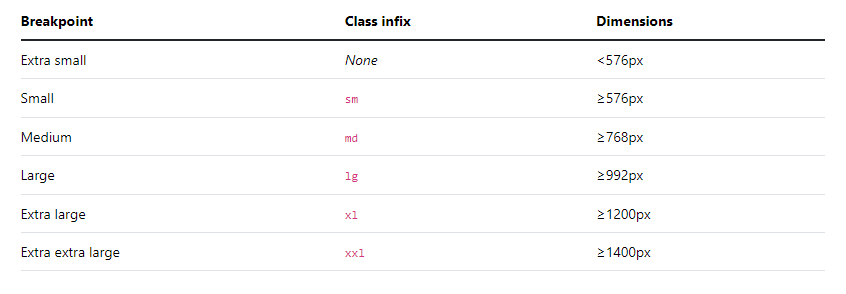

[Bootstrap Breakpoints](https://getbootstrap.com/docs/5.3/layout/breakpoints/)

## Bootstrap Containers
- Container এর কাজ হলো Elements কে Contain করা। কোন Elements কে Contain করা, Padding দেয়া এবং Alignment করার জন্য আমরা Container ব্যবহার করতে পারি।
- Bootstrap এ 3 ধরনের Container আছেঃ 

  1. `.container`, যা প্রতেক Breakpoints এ `max-width` set করে।
  2. `.container-{breakpoints}`, এর অর্থ ঐ Breakpoint না পাওয়া পর্যন্ত `width: 100%`
  3. `.container-fluid`, এর অর্থ `width: 100%` সব Breakpoint এ।

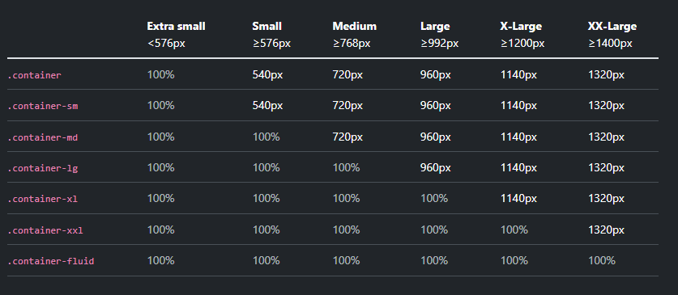

## Bootstrap Grid

- CSS Flexbox দিয়ে তৈরি। 12 Column-based Layout System.
- যেকোনো Shape এর Layout তৈরি করা যায়।
- Bootstrap Grid System তার Contents বা Elements সমূহকে Layout এবং Align করার জন্য Bootstrap Container, Rows and Columns ব্যবহার করে।

### Auto Column Layout

- যদি Column এর Width (যেমনঃ `col-6`) না দেয়া হয়, তাহলে Bootstrap সেগুলোকে সমান আকারে ভাগ করে দেয়।

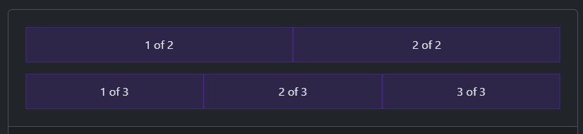

- আর যদি একটা Column এর Width দেয়া হয় যেমন `col-6` এবং বাকিগুলো না দেয়া হয়, তাহলে বাকিগুলোর জন্য যে জায়গা বাকি থাকে তা সমান ভাগে ভাগ করে নেয়। 

Code:
```html
<div class="container text-center">
  <div class="row">
    <div class="col">
      1 of 2
    </div>
    <div class="col">
      2 of 2
    </div>
  </div>
  <div class="row">
    <div class="col">
      1 of 3
    </div>
    <div class="col">
      2 of 3
    </div>
    <div class="col">
      3 of 3
    </div>
  </div>
</div>
```

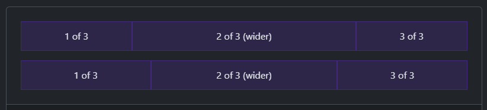

Code:

```html
<div class="container text-center">
  <div class="row">
    <div class="col">
      1 of 3
    </div>
    <div class="col-6">
      2 of 3 (wider)
    </div>
    <div class="col">
      3 of 3
    </div>
  </div>
  <div class="row">
    <div class="col">
      1 of 3
    </div>
    <div class="col-5">
      2 of 3 (wider)
    </div>
    <div class="col">
      3 of 3
    </div>
  </div>
</div>
```

### Variable width content
- `col-{breakpoint}-auto` এটা দেয়া হলে ঐ Breakpoint এ Content কে জায়গা দিতে যতটুকু Width দরকার, তততুকু Width নিবে। 

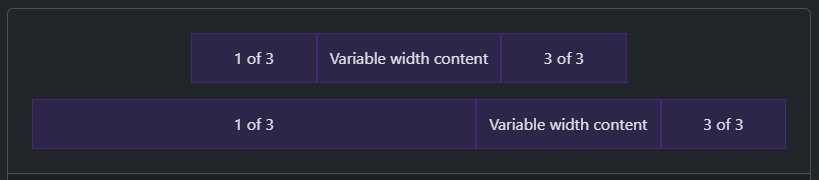

Code:

```html
<div class="container text-center">
  <div class="row justify-content-md-center">
    <div class="col col-lg-2">
      1 of 3
    </div>
    <div class="col-md-auto">
      Variable width content
    </div>
    <div class="col col-lg-2">
      3 of 3
    </div>
  </div>
  <div class="row">
    <div class="col">
      1 of 3
    </div>
    <div class="col-md-auto">
      Variable width content
    </div>
    <div class="col col-lg-2">
      3 of 3
    </div>
  </div>
</div>
```

### From Stacked to Horizontal
- ধরলাম আমরা যদি দুইটা কলাম `.col-md-8` এবং `.col-md-4` দেই, তাহলে তারা md breakpoint এর আগে Stacked (একটার উপর আরেকটা) থাকবে। যখনি md breakpoint এ পৌঁছবে তখনই তারা Horizontal (একটার পাশে আরেকটা ) হয়ে যাবে।

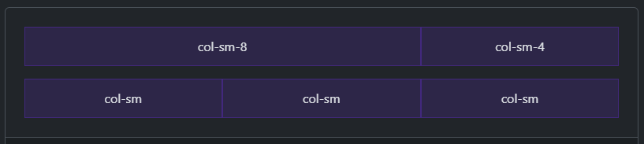

Code:

```html
<div class="container text-center">
  <div class="row">
    <div class="col-sm-8">col-sm-8</div>
    <div class="col-sm-4">col-sm-4</div>
  </div>
  <div class="row">
    <div class="col-sm">col-sm</div>
    <div class="col-sm">col-sm</div>
    <div class="col-sm">col-sm</div>
  </div>
</div>
```

_Note: এই বিষয়গুলো বুঝার জন্য Screen ছোট বড় করে দেখুন_

- নিচে আরও একটি উদাহরন দেয়া হলোঃ 

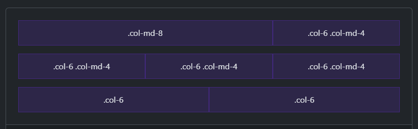

Code: 
```html
<div class="container text-center">
  <!-- Stack the columns on mobile by making one full-width and the other half-width -->
  <div class="row">
    <div class="col-md-8">.col-md-8</div>
    <div class="col-6 col-md-4">.col-6 .col-md-4</div>
  </div>

  <!-- Columns start at 50% wide on mobile and bump up to 33.3% wide on desktop -->
  <div class="row">
    <div class="col-6 col-md-4">.col-6 .col-md-4</div>
    <div class="col-6 col-md-4">.col-6 .col-md-4</div>
    <div class="col-6 col-md-4">.col-6 .col-md-4</div>
  </div>

  <!-- Columns are always 50% wide, on mobile and desktop -->
  <div class="row">
    <div class="col-6">.col-6</div>
    <div class="col-6">.col-6</div>
  </div>
</div>
```


<div align="right">
    <b><a href="#learn-bootstrap-in-30-chapters">↥ Go to Top</a></b>
</div>

# Chapter-02: Columns, Gutters, CSS Grid

- [Bootstrap Columns](#bootstrap-column)
- [Vertical Alignment](#vertical-alignment)
- [Horizontal Alignment](#horizontal-alignment)
- [Column Breaks](#column-breaks)
- [Reordering](#reordering)
- [Offsetting Columns](#offsetting-columns)


## Bootstrap Column
- Bootstrap Column-ও Grid এর মতো Flexbox ব্যবহার করে তৈরি করা হয়েছে।
- Alignment এবং Ordering করার জন্য আমরা Column ব্যবহার করতে পারি।
- Non-grid Element এ `.col` class ব্যবহার করে কিভাবে Width নিয়ে কাজ করা যায়, সেটাও আমরা দেখবো।

## Vertical Alignment

- `align-items-*` class ব্যবহার করে Vertically Align করা যায়। এই ক্লাস row তে ব্যবহার করতে হয়। 


```html
<div class="container text-center">
  <div class="row align-items-center">
    <div class="col">
      One of three columns
    </div>
    <div class="col">
      One of three columns
    </div>
    <div class="col">
      One of three columns
    </div>
  </div>
</div>
```

- আমরা চাইলে `.align-self-*` ব্যবহার করে প্রত্যেক Column ধরে ধরে তার Alignment Change করতে পারি। সেক্ষেত্রে যে Column এ Chaange করতে চাই সেই  Column তে ক্লাস দিতে হবে।

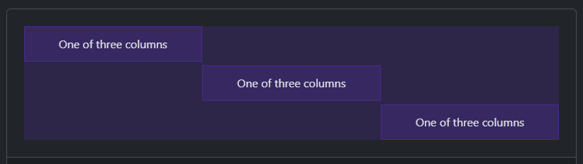

```html
<div class="container text-center">
  <div class="row">
    <div class="col align-self-start">
      One of three columns
    </div>
    <div class="col align-self-center">
      One of three columns
    </div>
    <div class="col align-self-end">
      One of three columns
    </div>
  </div>
</div>
```

## Horizontal Alignment
- `justify-content-*` class ব্যবহার করে Horizontally Align করা যায়। এই ক্লাস row তে ব্যবহার করতে হয়। 

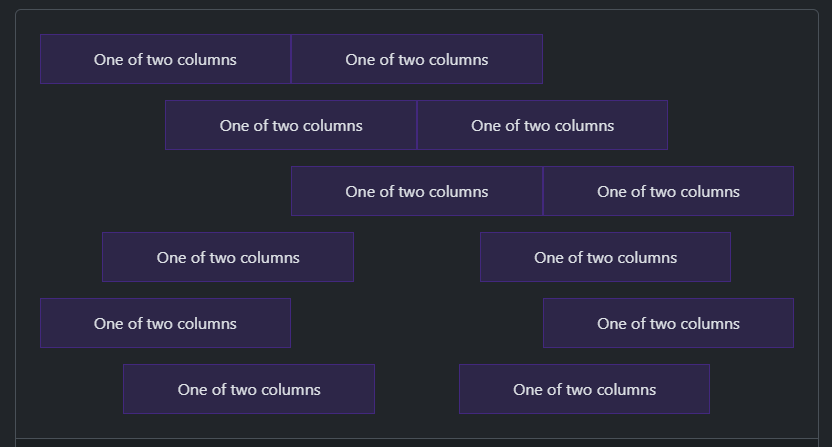

```html
<div class="container text-center">
  <div class="row justify-content-start">
    <div class="col-4">
      One of two columns
    </div>
    <div class="col-4">
      One of two columns
    </div>
  </div>
  <div class="row justify-content-center">
    <div class="col-4">
      One of two columns
    </div>
    <div class="col-4">
      One of two columns
    </div>
  </div>
  <div class="row justify-content-end">
    <div class="col-4">
      One of two columns
    </div>
    <div class="col-4">
      One of two columns
    </div>
  </div>
  <div class="row justify-content-around">
    <div class="col-4">
      One of two columns
    </div>
    <div class="col-4">
      One of two columns
    </div>
  </div>
  <div class="row justify-content-between">
    <div class="col-4">
      One of two columns
    </div>
    <div class="col-4">
      One of two columns
    </div>
  </div>
  <div class="row justify-content-evenly">
    <div class="col-4">
      One of two columns
    </div>
    <div class="col-4">
      One of two columns
    </div>
  </div>
</div>
```

## Column breaks
- আমরা যদি Column এর মধ্যে ব্রেক দিতে চাই, তাহলে ছোট্ট একটা ট্রিক খাঁটাতে হবে, আর সেটা হলো `<div class="w-100"></div>` ব্যবহার করতে হবে। 
- এছাড়া আমরা চাইলে নির্দিষ্ট breakpoint এও Column break করতে পারি। যেমনঃ `<div class="w-100 d-none d-md-block"></div>`


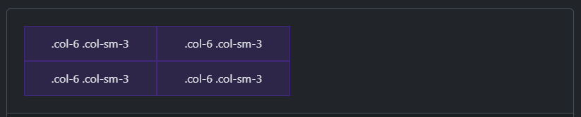

```html
<div class="container text-center">
  <div class="row">
    <div class="col-6 col-sm-3">.col-6 .col-sm-3</div>
    <div class="col-6 col-sm-3">.col-6 .col-sm-3</div>

    <!-- Force next columns to break to new line -->
    <div class="w-100"></div>

    <div class="col-6 col-sm-3">.col-6 .col-sm-3</div>
    <div class="col-6 col-sm-3">.col-6 .col-sm-3</div>
  </div>
</div>
```

- আবার চাইলে একটা Specific Breakpoint এও break করা যায়। যেমনঃ 

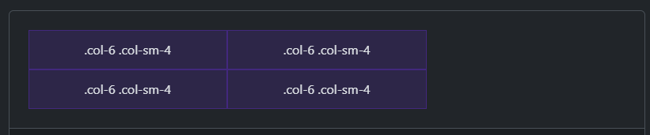

```html
<div class="container text-center">
  <div class="row">
    <div class="col-6 col-sm-4">.col-6 .col-sm-4</div>
    <div class="col-6 col-sm-4">.col-6 .col-sm-4</div>

    <!-- Force next columns to break to new line at md breakpoint and up -->
    <div class="w-100 d-none d-md-block"></div>

    <div class="col-6 col-sm-4">.col-6 .col-sm-4</div>
    <div class="col-6 col-sm-4">.col-6 .col-sm-4</div>
  </div>
</div>
```

## Reordering

- `.order-` class ব্যবহার করে আমরা Column এর  Visual Order বদলাতে পারি। `order-1` থেকে `order-5` পর্যন্ত আছে। এছাড়া `order-first` এবং `order-last` ক্লাসও আছে। এগুলো responsive class অর্থাৎ এই ক্লাসগুলোর সাথে আমরা breakpointsও দিতে পারি, যেমনঃ `order-md-2`


```html
<div class="container text-center">
  <div class="row">
    <div class="col">
      First in DOM, no order applied
    </div>
    <div class="col order-5">
      Second in DOM, with a larger order
    </div>
    <div class="col order-1">
      Third in DOM, with an order of 1
    </div>
  </div>
</div>
```

## Offsetting columns
- আপনি দুটি উপায়ে গ্রিড কলাম অফসেট বা Left Margin করতে পারেন: Bootstrap এর responsive `.offset` গ্রিড ক্লাস এবং মার্জিন ইউটিলিটি।

## Bootstrap Gutters
- Bootstrap Gutter এর মাধ্যমে আমরা Columns এ Horizontally এবং Vertically Padding দিতে পারি। `gx-*` দিয়ে Horizontally এবং `gy-*` দিয়ে Vertically Padding দিতে পারি।

<div align="right">
    <b><a href="#learn-bootstrap-in-30-chapters">↥ Go to Top</a></b>
</div>

# Chapter-03: Reboot, Typography, Images, Tables, Figures

- [What is Reboot Concept in Bootstrap?](#what-is-reboot-concept-in-bootstrap)
  - [By Default কি কি Reboot করা হলো?](#by-default-কি-কি-reboot-করা-হলো)
  - [Heading এ যা Reboot করা হলো](#heading-এ-যা-reboot-করা-হলো)
  - [Paragraph এ যা Reboot করা হলো](#paragraph-এ-যা-reboot-করা-হলো)
  - [Link এ যা Reboot করা হলো](#link-এ-যা-reboot-করা-হলো)
- [Bootstrap Typography](#bootstrap-typography)

## What is Reboot Concept in Bootstrap?

- Bootstrap অনেক HTML Elements এর By default আচরণকে কিছুটা নিজেদের মত করে পরিবর্তন করে দিয়েছে। এই Concept টাকেই Reboot বলা হচ্ছে।
- শুধু HTML ফাইলে Element টা ব্যবহার করলেই আমরা সেই পরিবর্তনগুলো দেখতে পাবো, এরজন্য অতিরিক্ত কোন Class ব্যবহার করতে হবে না। তবে আমরা চাইলে Bootstrap এর Class ব্যবহার করে নিজেদের মত Style করতেই পারি!

যেমন, সব Heading Elements (`<h1>`, `<h2>`, `<h3>`, `<h4>`, `<h5>`, `<h6>`) থেকে `margin-top` removed করে দেয়া হয়েছে।

### By Default কি কি Reboot করা হলো?

- `box-sizing: border-box` এইটা প্রত্যেকটা element এবং তাদের `*::before` এবং `*::after` এ সেট করে দেয়া হয়েছে।
- `<html>` element এ কোন base `font-size` দেয়া হয়নি। base font size সাধারণত 16px থাকে (browser default).
- Body তে `font-size: 1rem` সেট করা থাকে। অর্থাৎ যদি html element এ base font-size যদি 16px হয়, তাহলে body তেও সেই 16px থেকে যায়।
- Body তে globally একটা `font-family`, `font-weight`, `line-height`, `background-color` (`#fff`) এবং `color` সেট করা হয়।
- সবচেয়ে মজার যে বিষয় তা হলো Bootstrap ভিন্ন ভিন্ন Devices এবং OS এ ভিন্ন ভিন্ন `font-family` set করে। যেমন, macOS এবং iOS এর ক্ষেত্রে `-apple-system`, windows এর ক্ষেত্রে `Segoe UI`, Android এর ক্ষেত্রে `Roboto`, Linux এর ক্ষেত্রে `Noto Sans` ব্যবহার করা হয়, এর সাথে সাথে কিছু fallback font-ও ব্যবহার করা হয়।
  তারমানে বুঝা গেলো একজন Developer Code শুরু করার আগেই Bootstrap smartly তারহয়ে অনেক কিছু Reset করে দেয়!

### Heading এ যা Reboot করা হলো

- `margin-top` removed.
- `margin-bottom: 0.5rem` সেট করা হয়েছে।

### Paragraph এ যা Reboot করা হলো

- `margin-top` removed.
- `margin-bottom: 1rem` সেট করা হয়েছে।

### Link এ যা Reboot করা হলো

- link এ Underline সহ একটা color থাকে।
- link `visited` হলে এর color পরিবর্তন হবে না।

### Horizontal Rules এ যা Reboot করা হলো

- `opacity: 0.25` সেট করা থাকে।
- `border-color` এর কালার `color` এর মাধ্যমে Inherit করে। অর্থাৎ `<hr>` এর Parent এর text color যদি green হয়, তাহলে `<hr>` এর border color-ও green হবে।

### Lists এ যা Reboot করা হলো

- `margin-top` removed.
- `margin-bottom: 1rem` সেট করা হয়েছে।
- Nested lists এর কোন `margin-bottom` নেই।

### `<code>` এবং `<pre>` তে যা Reboot করা হলো

### Variables এ যা Reboot করা হলো

### User Input এ যা Reboot করা হলো

### Sample Output এ যা Reboot করা হলো

### Tables এ যা Reboot করা হলো

### Forms এ যা Reboot করা হলো

- `<fieldset>` থেকে border, margin এবং padding removed করা হয়েছে।
- `<label>` কে `display: inline-block` করা হয়েছে যাতে margin ব্যবহার করা যায়।
- `<input>`, `<select>`, `<textarea>` এবং `<button>` একটা Basic Style দেয়া হয়েছে।
- Button Element এ `cursor: pointer` সেট করে দেয়া হয়েছে।

### Address Element এ যা Reboot করা হলো

### Blockquote এ যা Reboot করা হলো

### `<abbr>` Element এ যা Reboot করা হলো

### Summary Element এ যা Reboot করা হলো

### Hidden Attribute এ যা Reboot করা হলো

## Bootstrap Typography
- Bootstrap Typography সেকশনে আমরা Font, Font Size, Line Height, Heading, Display ইত্যাদি বিষয় নিয়ে আলোচনা করবো। 

### Heading
- HTML এ h1 থেকে h6 পর্যন্ত সবগুলো heading elements available. এছাড়া কোন element যদি heading element নাও হয়, তবুও আমরা heading element এর size দিতে পারি `.h1`, `.h2`, `.h3`, `.h4`, `.h5`, `.h6` এই ক্লাসগুলো ব্যবহার করে। যেমন, আমারা যদি একটি p element এ h1 এর ক্লাস ব্যবহার করি তাহলে p element এর font size, h1 element এর মতো size হয়ে যাবে। যেমনঃ 
```html
<p class="h1">h1. Bootstrap heading</p>
<p class="h2">h2. Bootstrap heading</p>
<p class="h3">h3. Bootstrap heading</p>
<p class="h4">h4. Bootstrap heading</p>
<p class="h5">h5. Bootstrap heading</p>
<p class="h6">h6. Bootstrap heading</p>
```

### Display Heading

- Traditional Heading এর চেয়েও যদি বড় Font Size দরকার হয় সেক্ষেত্রে আমরা Display Heading ব্যবহার করতে পারি। যেমনঃ
```html
<h1 class="display-1">Display 1</h1>
<h1 class="display-2">Display 2</h1>
<h1 class="display-3">Display 3</h1>
<h1 class="display-4">Display 4</h1>
<h1 class="display-5">Display 5</h1>
<h1 class="display-6">Display 6</h1>
```
Output:
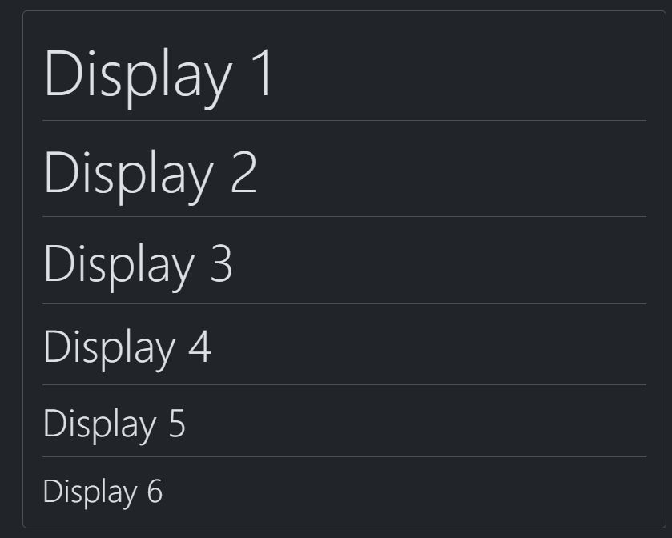

### Naming a Source
- কোন Quote এর সাথে যদি আমরা Source-ও লিখতে চাই তাহলে প্রথমে `<figure>` element এর মধ্যে `<blockquote>` ও `<figcaption>` দিতে হবে। নিচে উদাহরন দেয়া হলোঃ 

```html
<figure class="text-center">
  <blockquote class="blockquote">
    <p>A well-known quote, contained in a blockquote element.</p>
  </blockquote>
  <figcaption class="blockquote-footer">
    Someone famous in <cite title="Source Title">Source Title</cite>
  </figcaption>
</figure>
```
Output:
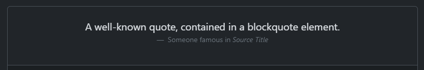


## Bootstrap Images
- কোন ইমেজে `.img-fluid` এই ক্লাস দিলে ঐ ইমেজটিতে `max-width: 100%; and height: auto;` Apply হয়ে যায়। 
- `.img-thumbnail` class ব্যবহার করলে ইমেজের border 1px rounded হয়ে যায়। 

### Aligning The Images

Images কে 3 ভাবে Align করা যায়ঃ
- Using `.float-start` and `.float-end`
```html


```
- Using `.text-start`, `.text-end` and `.text-center`
```html
<div class="text-center">
  
</div>
```
- Image একটা Inline-element, তাই Image কে প্রথমে block element বানিয়ে অতঃপর `mx-auto` করলে Center এ চলে যাবে। 
```html

```

## Bootstrap Tables
- `.table` class ব্যবহার করলেই Bootstrap নিজের মতো সুন্দর একটা Layout দিবে। 

```html
<table class="table">
  <thead>
    <tr>
      <th scope="col">#</th>
      <th scope="col">First</th>
      <th scope="col">Last</th>
      <th scope="col">Handle</th>
    </tr>
  </thead>
  <tbody>
    <tr>
      <th scope="row">1</th>
      <td>Mark</td>
      <td>Otto</td>
      <td>@mdo</td>
    </tr>
    <tr>
      <th scope="row">2</th>
      <td>Jacob</td>
      <td>Thornton</td>
      <td>@fat</td>
    </tr>
    <tr>
      <th scope="row">3</th>
      <td colspan="2">Larry the Bird</td>
      <td>@twitter</td>
    </tr>
  </tbody>
</table>
```
Output:
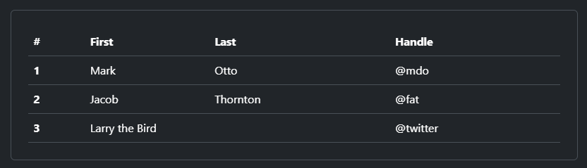

- Bootstrap দিয়ে আমরা Row, Column এবং পুরো Table কে কালার দিতে পারি। 
```html
<!-- On tables -->
<table class="table-primary">...</table>
<table class="table-secondary">...</table>
<table class="table-success">...</table>
<table class="table-danger">...</table>
<table class="table-warning">...</table>
<table class="table-info">...</table>
<table class="table-light">...</table>
<table class="table-dark">...</table>

<!-- On rows -->
<tr class="table-primary">...</tr>
<tr class="table-secondary">...</tr>
<tr class="table-success">...</tr>
<tr class="table-danger">...</tr>
<tr class="table-warning">...</tr>
<tr class="table-info">...</tr>
<tr class="table-light">...</tr>
<tr class="table-dark">...</tr>

<!-- On cells (`td` or `th`) -->
<tr>
  <td class="table-primary">...</td>
  <td class="table-secondary">...</td>
  <td class="table-success">...</td>
  <td class="table-danger">...</td>
  <td class="table-warning">...</td>
  <td class="table-info">...</td>
  <td class="table-light">...</td>
  <td class="table-dark">...</td>
</tr>
```

Output:
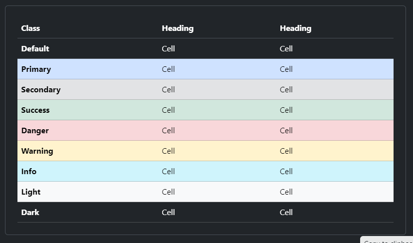

- বিভিন্ন ক্লাস ও তাদের কাজ 

| No. | Class              | Attribute       | Reason                                                                                                 |
| --- | ------------------ | --------------- | ------------------------------------------------------------------------------------------------------ |
| 1   |  table            |                 | `<table>` element এ এই ক্লাস দিলে Bootstrap by default layout কে reboot করে নিজের মতো সুন্দর একটা Layout দেয়                                                                                  |
| 2   | table-primary      |                 | Color দেয়ার জন্য এই ক্লাস আমরা `<tr>`, `<td>` এমনকি `<table>` element এও দিতে পারি                                                                             |
| 3   |      table-striped              |             | `<table>` element এ এই ক্লাস দিলে Stripped design পাওয়া যায়।                                                        |
| 4   | table-striped-columns          |                 | আমরা চাইলে শুধু কলাম কেও Stripped দিয়ে পারি। এখেত্রেও এই ক্লাস `<table>` element এই দিতে হবে                                                      |
| 5   |      table-hover              |  | এই ক্লাস `<table>` element এ দিতে হয়। এর ফলে প্রত্যেকটি Row এ Hover effect যুক্ত হয়                                                                  |
| 6   | table-active |                 | যে Row কে Active রাখতে চাই, সেই Row তে এই ক্লাস দিতে হয়। একটি নির্দিষ্ট Cell এও এই ক্লাস ব্যবহার করা যায়                                                                   |
| 7   | table-bordered      |                 | আমরা যদি পুরো Table এ Border অ্যাড করতে চাই (সবগুলো cell সহ) তাহলে এই ক্লাস `<table>` element এ অ্যাড করতে হয়                               |
| 8   | table-borderless         |                 | পুরো Table এ যদি কোন Border না রাখতে চাই তাহলে `<table>` element এ এই ক্লাস ব্যবহার করা হয়  |
| 9   | table-sm |                 | এই ক্লাস `<table>` element এ দিতে হয়। এর ফলে পুরো Table আরও Compact হয়ে Render হয়। কারন এই ক্লাস প্রত্যেক Cell এর Padding remove করে ফেলে |
| 10   | table-group-divider |                 | এই ক্লাস `<tbody>` element এ দিতে হয়। ফলে একটা বড় Border উপরের `<thead>` কে পৃথক করে |

Table Group Divider Example:
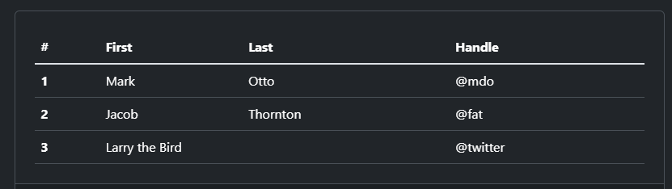

### Table Caption

- `<caption>` element add করে আমরা Table এর Caption দিতে পারি। নিচে উদাহরন দেয়া হলোঃ 
```html
<table class="table table-sm">
  <caption>List of users</caption>
  <thead>
    ...
  </thead>
  <tbody>
    ...
  </tbody>
</table>
```
Output:
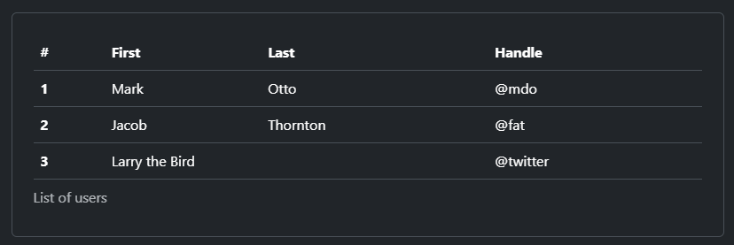

- Caption যদি উপরে দিতে চান,  তাহলে আমরা `<table>` element এ `caption-top` ক্লাস ব্যবহার করতে হবে। যেমনঃ 
```html
<table class="table caption-top">
  <caption>List of users</caption>
  <thead>
    <tr>
      <th scope="col">#</th>
      <th scope="col">First</th>
      <th scope="col">Last</th>
      <th scope="col">Handle</th>
    </tr>
  </thead>
  <tbody>
    <tr>
      <th scope="row">1</th>
      <td>Mark</td>
      <td>Otto</td>
      <td>@mdo</td>
    </tr>
    <tr>
      <th scope="row">2</th>
      <td>Jacob</td>
      <td>Thornton</td>
      <td>@fat</td>
    </tr>
    <tr>
      <th scope="row">3</th>
      <td>Larry</td>
      <td>the Bird</td>
      <td>@twitter</td>
    </tr>
  </tbody>
</table>
```

Output:
[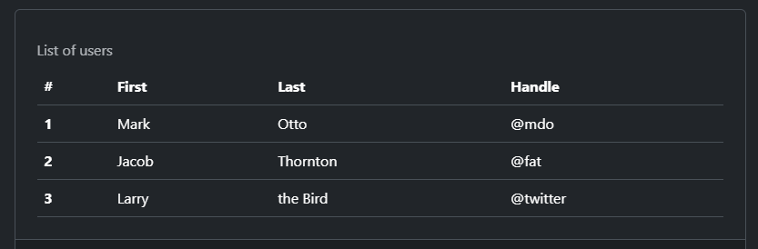]

### Responsive tables
- `.table-responsive` class ব্যবহার করে আমরা Responsive Table তৈরি করতে পারি। ফলে Table এর Space না থাকলে Scrollbar অ্যাড হয়ে যাবে। যেমনঃ
```html
<div class="table-responsive">
  <table class="table">
    ...
  </table>
</div>
```
## Bootstrap Figurs
- `.figure` class `<figure>` element এ, `.figure-img` `` element এ এবং `.figure-caption` element `<figcaption>` elment এ দিয়ে আমরা কোন Image এর সাথে Caption অ্যাড করতে পারি। ফলে Bootstrap নিজের মতো কিছু Style দিয়ে দেয়। যেমনঃ 
```html
<figure class="figure">
  
  <figcaption class="figure-caption">A caption for the above image.</figcaption>
</figure>
```
Output:
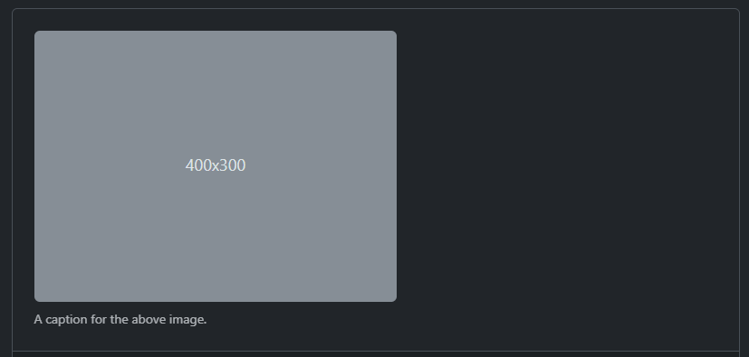

<div align="right">
    <b><a href="#learn-bootstrap-in-30-chapters">↥ Go to Top</a></b>
</div>

# Chapter-04: Bootstrap Form

- [Form Control]()
- [Select]()
- [Checks and Radios]()
- [Range]()
- [Input Group]()
- [Floating Labels]()
- [Layout]()
- [Validation]()
- [Assignments]()

## Form Control

## Select

## Checks and Radios

## Range

## Input Group

## Layout

## Validation

## Assignments

### Problem-01


### Problem-02


### Problem-03


# Chapter-05: Bootstrap Accordion, Alerts, Badges, Breadcrumbs, Buttons and Button Group

- [Accordion](#bootstrap-accordion)
- [Alerts](#bootstrap-alerts)
- [Badges](#bootstrap-badge)
- [Breadcrumbs](#bootstrap-breadcrumbs)
- [Button](#bootstrap-button)
- [Button Group](#bootstrap-button-group)
- [Assignments for Chapter 5](#assignments-for-chapter-5)
  - [Assignment 1](#assignments-1-for-chapter-5)
  - [Assignment 2](#assignments-2-for-chapter-5)
  - [Assignment 3](#assignments-3-for-chapter-5)
  - [Assignment 4](#assignments-4-for-chapter-5)

## Bootstrap Accordion

- Bootstrap দিয়ে Accordion তৈরি করতে যে যে Classes এবং Attributes লাগে তা নিচে দেয়া হলোঃ

## Bootstrap Alerts

- Bootstrap দিয়ে Alerts তৈরি করতে যে যে Classes এবং Attributes লাগে তা নিচে দেয়া হলোঃ

| No. | Class              | Attribute       | Reason                                                                                                 |
| --- | ------------------ | --------------- | ------------------------------------------------------------------------------------------------------ |
| 1   | alert              |                 | alert তৈরি করার জন্য।                                                                                  |
| 2   | alert-primary      |                 | alert এর Color দেয়ার জন্য।                                                                             |
| 3   |                    | role            | alert টা কি Role play করছে সেটা বলে দেয়ার জন্য।                                                        |
| 4   | btn-close          |                 | Button টা কি Type এর Button, সেটা বলে দেয়ার জন্য।                                                      |
| 5   |                    | data-bs-dismiss | Close Button টাকে Workable করার জন্য।                                                                  |
| 6   | alert-dismissiable |                 | Close Button টা ডান পাশে নেবার জন্য।                                                                   |
| 7   | fade and show      |                 | Alert টা Smoothly চলে যায়, সেজন্য এই দুইটা ক্লাস একসাথে ব্যবহার করতে হয়।                               |
| 8   | alert-link         |                 | Alert এর মধ্যে যদি আমরা কোন লিংক ব্যবহার করতে চাই, সেই লিংকটা যেন Alert এর Color কে Follow করে সেজন্য। |

## Bootstrap Badge

## Bootstrap Breadcrumb

- Bootstrap দিয়ে Breadcrumb তৈরি করতে যে যে Classes এবং Attributes লাগে তা নিচে দেয়া হলোঃ

| **No.** | **Class**       | **Attribute** | **Reason**                         |
| ------- | --------------- | ------------- | ---------------------------------- |
| 1       | breadcrumb      |               | breadcrumb তৈরি করার জন্য।         |
| 2       | breadcrumb-item |               | breadcrumb এর Item তৈরি করার জন্য। |
| 3       | active          |               | Active Page এর জন্য।               |

## Bootstrap Button

- Bootstrap দিয়ে Button তৈরি করতে যে যে Classes এবং Attributes লাগে তা নিচে দেয়া হলোঃ

| **No.** | **Class**           | **Attribute**  | **Reason**                                                                                                                                          |
| ------- | ------------------- | -------------- | --------------------------------------------------------------------------------------------------------------------------------------------------- |
| 1       | btn                 |                | Bootstrap Button তৈরি করার জন্য।                                                                                                                    |
| 2       |                     | type           | Element টা যে একটা Button Type সেটা বলে দেয়ার জন্য।                                                                                                 |
| 3       | btn-primary         |                | Button এর কালার দেয়ার জন্য।                                                                                                                         |
| 4       | btn-outline-primary |                | Outline Button তৈরি করার জন্য।                                                                                                                      |
| 5       | btn-lg              |                | Large Button তৈরি করার জন্য।                                                                                                                        |
| 6       | btn-sm              |                | Small Button তৈরি করার জন্য।                                                                                                                        |
| 7       |                     | role           | আমরা Button ছাড়াও অন্য elements যেমন `<a>` এবং `<input>` কে অনেক সময় Button হিসেবে ব্যবহার করতে পারি। সেজন্য Role Attribute এ Button Value দিতে হয়। |
| 8       |                     | disabled       | Button কে Disabled করার জন্য।                                                                                                                       |
| 9       |                     | data-bs-toggle | Button এ Toggle Mode দেয়ার জন্য।                                                                                                                    |

## Bootstrap Button Group

- Bootstrap দিয়ে Button Group তৈরি করতে যে যে Classes এবং Attributes লাগে তা নিচে দেয়া হলোঃ

| **No.** | **Class**          | **Attribute** | **Reason**                                      |
| ------- | ------------------ | ------------- | ----------------------------------------------- |
| 1       | btn-group          |               | Horizontally Button Group তৈরি করার জন্য।       |
| 2       | btn-group-lg       |               | Horizontally Large Button Group তৈরি করার জন্য। |
| 3       | btn-group-sm       |               | Horizontally Small Button Group তৈরি করার জন্য। |
| 4       | btn-group-vertical |               | Vertically Button Group তৈরি করার জন্য।         |
| 5       | btn-toolbar        |               | Button Toolbar তৈরি করার জন্য।                  |

## Assignments for Chapter 5

### Assignments 1 for Chapter 5


### Assignments 2 for Chapter 5


### Assignments 3 for Chapter 5


### Assignments 4 for Chapter 5


<div align="right">
    <b><a href="#learn-bootstrap-in-30-chapters">↥ Go to Top</a></b>
</div>

# Chapter 06: Bootstrap Card, Carousel, Close Button, Collapse, List Group, Dropdowns, Navbar, Navs and Tabs

- [Bootstrap Card](#bootstrap-card)
- [Bootstrap Carousel](#bootstrap-carousel)
- [Bootstrap Close Button](#bootstrap-close-button)
- [Bootstrap Collapse](#bootstrap-collapse)
- [Bootstrap List Group](#bootstrap-list-group)
- [Bootstrap Navbar and Dropdowns](#bootstrap-navbar-and-dropdowns)
- [Bootstrap Navs and Tabs](#bootstrap-navs-and-tabs)
- [Assignments](#assignment-for-chapter-6)

## Bootstrap Card

- Bootstrap দিয়ে Card তৈরি করতে যে যে Classes এবং Attributes লাগে তা নিচে দেয়া হলোঃ

| **No.** | **Class**           | **Attribute** | **Reason**                                          |
| ------- | ------------------- | ------------- | --------------------------------------------------- |
| 1       | card                |               | Bootstrap Card তৈরি করার জন্য।                      |
| 2       | card-body           |               | Card এর Body তৈরি করার জন্য                         |
| 3       | card-title          |               | Body এর মধ্যে Card এর Title দেয়ার জন্য              |
| 4       | card-subtitle       |               | Body এর মধ্যে Card Subtitle তৈরি করার জন্য          |
| 5       | card-img-top        |               | Card এর মধ্যে Image Add করার জন্য।                  |
| 6       | card-text           |               | Card Body এর মধ্যে Text Add করার জন্য।              |
| 7       | card-header         |               | Card এর Header দেয়ার জন্য                           |
| 8       | card-footer         |               | Card এর Footer Add করার জন্য।                       |
| 9       | text-body-secondary |               | Card Body বা Footer এ Secondary Text Add করার জন্য। |
| 10      | card-group          |               | অনেকগুলা Card তৈরি করার জন্য।                       |

## Bootstrap Carousel

Bootstrap দিয়ে Carousel তৈরি করতে যে যে Classes এবং Attributes লাগে তা নিচে দেয়া হলোঃ

| **No.** | **Class**                  | **Attribute**           | **Reason**                                                                                                                                           |
| ------- | -------------------------- | ----------------------- | ---------------------------------------------------------------------------------------------------------------------------------------------------- |
| 1       | carousel                   |                         | Carousel বা Slider তৈরি করার জন্য।                                                                                                                   |
| 2       | carousel-inner             |                         | Carousel Inner এর মধ্যে Carousel সব Items রাখতে হয়।                                                                                                  |
| 3       | carousel-item              |                         | Carousel Item বা Image Add করার জন্য।                                                                                                                |
| 4       | slide                      |                         | Carousel এ Slide Behavior দেয়ার জন্য                                                                                                                 |
| 5       |                            | data-bs-ride="carousel" | Carousel autoplay হওয়ার জন্য                                                                                                                         |
| 6       | active                     |                         | প্রথম Item কে Active না দিলে Carosel কাজ করবে না                                                                                                     |
| 7       | carousel-control-prev      |                         | Button এ Indicator Functionality add করার জন্য, অর্থাৎ এই Indicator এ প্রেস করলে আগের Image বা Slider টা দেখাবে                                      |
| 8       |                            | data-bs-target="#abc"   | এই Indicator কাকে Target করবে সেইটা বলে দেয়ার জন্য button এ এই Attribute ব্যবহার করা হয়                                                              |
| 9       | carousel-control-prev-icon |                         | Button এর মধ্যে একটা Span Element এ এই ক্লাস দিলে Indicator এর Icon টা Show হবে                                                                      |
| 10      |                            | data-bs-slide="prev"    | Indicator টা কাজ করার জন্য                                                                                                                           |
| 11      | carousel-indicators        |                         | নিচের দিকে Indicator তৈরি করার জন্য                                                                                                                  |
| 12      | active                     | data-bs-slide-to="0"    | carousel-indicators এর মধ্যে Button এ এই Attribute দিলে Slider কাজ করবে। এর সাথে class="active" ও দিতে হবে। এছাড়া data-bs-target Attribute দিতে হবে। |
| 13      |                            | data-bs-touch="true"    | carousel class element এ এই Attribute দিলে Slider টা Touch এও কাজ করবে, যেমন Mobile এ।                                                               |
| 14      | carousel-fade              |                         | carousel class element এ এই Class দিলে Slider এর Behivior Fade-in এর মতো হবে                                                                         |
| 15      | carousel-caption           |                         | carousel-item element এর মধ্যে carousel-caption element তৈরি করে আমরা চাইলে Caption add করতে পারি                                                    |

## Bootstrap Close Button

Bootstrap দিয়ে Close Button তৈরি করতে `btn-close` Class টি ব্যবহার করতে হয়।

## Bootstrap Collapse

- Bootstrap দিয়ে Collapse তৈরি করতে যে যে Classes এবং Attributes লাগে তা নিচে দেয়া হলোঃ

| **No.** | **Class** | **Attribute**             | **Reason**                                                                                                                                                                            |
| ------- | --------- | ------------------------- | ------------------------------------------------------------------------------------------------------------------------------------------------------------------------------------- |
| 1       | collapse  |                           | Bootstrap Collapse Element তৈরি করার জন্য। Collapse Element যেকোনো কিছুই হতে পারে যেমনঃ Card, Form ইত্যাদি।                                                                           |
| 2       |           | data-bs-toggle="collapse" | যে Button এ ক্লিক করলে Content Collapse করবে বা Reveal হবে সেই Button এ এই Attribute দিতে হবে।                                                                                        |
| 3       |           | data-bs-target="#abc"     | যে Button এ ক্লিক করলে Content Collapse করবে বা Reveal হবে সেই Button এ এই Attribute দিতে হবে যাতে ঐ Content কে সে Target করতে পারে। এখানে এই Attribute না দিয়ে href="#abc" দিলেও হবে |

## Bootstrap List Group

- Bootstrap দিয়ে List Group তৈরি করতে যে যে Classes এবং Attributes লাগে তা নিচে দেয়া হলোঃ

| **No.** | **Class**           | **Attribute** | **Reason**                                                                                                                              |
| ------- | ------------------- | ------------- | --------------------------------------------------------------------------------------------------------------------------------------- |
| 1       | list-group          |               | List Group তৈরি করার জন্য                                                                                                               |
| 2       | list-group-item     |               | List এর Item তৈরি করার জন্য list-group class এর ভিতরে এই ক্লাস দেয়া হয়                                                                  |
| 3       | active              |               | যে Item কে Active করতে চাই, সেই Item এ এই ক্লাস দেয়া হয়                                                                                 |
| 4       | list-group-flush    |               | ডান ও বামের Border ছাড়া List তৈরি করতে চাইলে যে element এ list-group class ব্যবহার করা হয়েছে সেই element এ এই ক্লাসটাও ব্যবহার করতে হবে |
| 5       | list-group-numbered |               | Item গুলো Number সহ Display করতে চাইলে যে element এ list-group class ব্যবহার করা হয়েছে সেই element এ এই ক্লাসটাও ব্যবহার করতে হবে       |

- Actionable List Group with Hover তৈরি করার জন্য `<li>` element এর পরিবর্তে `<a>` অথবা `<button>` element ব্যবহার করা হয়। Hover Effect এর জন্য প্রতিটা item এ **_list-group-item-action_** এই ক্লাস Add করতে হয়।

## Bootstrap Navbar and Dropdowns

- Bootstrap দিয়ে Navbar তৈরি করতে যে যে Classes এবং Attributes লাগে তা নিচে দেয়া হলোঃ

| **No.** | **Class**                    | **Attribute**             | **Reason**                                                                                                                                                                   |
| ------- | ---------------------------- | ------------------------- | ---------------------------------------------------------------------------------------------------------------------------------------------------------------------------- |
| 1       | navbar                       |                           | Navbar তৈরি করার জন্য।                                                                                                                                                       |
| 2       | navbar-brand                 |                           | Logo বা Company Name তৈরি করার জন্য                                                                                                                                          |
| 3       | navbar-nav                   |                           | সবগুলা Nav Menu এর Parent Element কে এই ক্লাস দিতে হয়                                                                                                                        |
| 4       | nav-item and nav-link        |                           | navbar-nav এর Child Elemenets এ nav-item ক্লাস দিয়ে Nav Menu তৈরি করতে হয়। প্রতিটা nav-item এর ভিতরে আবার প্রতিটা Anchor tag এর জন্য nav-link ক্লাস দিতে হয়                  |
| 5       | navbar-expand-lg             |                           | Navbar টা Large বা তার চেয়ে বড় Screen এ Expand করবে। যে Element এ আমরা navbar class দিয়েছি ঐ element এ-ই এই ক্লাসটা দিতে হবে                                                 |
| 6       | navbar-toggler               | data-bs-toggle="collapse" | navbar-brand element এর ঠিক নিচে Button element এই ক্লাস এবং Attribute দিতে হবে। এই ক্লাস এবং Attribute দিতে হবে Navbar Toggler তৈরি করার জন্য                               |
| 7       | navbar-toggler-icon          |                           | navbar-toggler এর Child Element Span Tag এ এই ক্লাস টা দিতে হয় Toggler Icon এর জন্য                                                                                          |
| 8       | collapse and navbar-collapse |                           | Parent Breakpoint দ্বারা Navbar Contents কে গ্রুপ এবং Hide করার জন্য এই দুইটা ক্লাস একসাথে ব্যবহার করতে হয়                                                                   |
| 9       |                              | data-bs-target="#abc"     | navbar-toggler এবং navbar-collapse element দুটোকে লিংক করতে এই Attribute ব্যবহার করতে হবে। যাতে Button এ একবার ক্লিক করলে Menu গুলো দেখা যায় আরেকবার ক্লিক করলে হাইড হয়ে যায় |
| 10       |        dropdown                      |      | যে nav-item কে আমরা Dropdown Menu করতে চাই ঐ nav-item ক্লাস সাথেই এই ক্লাসটা দিতে হবে |
| 11       |       dropdown-toggle                       |  data-bs-toggle="dropdown"    | nav-item এর ভিতরে যে anchor element আছে ঐ anchor element কে এই Class এবং Attribute দিতে হবে |
| 12       |       dropdown-menu and dropdown-item                       |      | nav-item এর ভিতরে ul এ dropdown-menu এবং ul এর ভিতর li এবং তার ভিতর anchor tag এ dropdown-item ক্লাস দিতে হবে |


## Bootstrap Navs and Tabs

- Bootstrap এ .nav component টা Flexbox দিয়ে তৈরি। তাই এই element এ flexbox এর ক্লাস যেমন `justify-content-center` এগুলা কাজ করবে। 
- Bootstrap দিয়ে Navs with Tabs তৈরি করতে যে যে Classes এবং Attributes লাগে তা নিচে দেয়া হলোঃ

| **No.** | **Class**           | **Attribute** | **Reason**                                          |
| ------- | ------------------- | ------------- | --------------------------------------------------- |
| 1       | nav                |               | Navbar তৈরি করার জন্য                      |
| 2       | nav-item           |               | Navbar এর Item তৈরি করার জন্য Nav element এর মধ্যে li element এ এই ক্লাস দিতে হয়                         |
| 3       | nav-link          |               |    li element এর মধ্যে anchor tag এ এই ক্লাস দিতে হয়           |
| 4       | flex-column      |               | Nav Items গুলো Vertically Align করার জন্য। এই ক্লাস nav class এর সাথেই দিতে হয়।           |
| 5       | nav-tabs       |               | Nav Items গুলো Tab আঁকারে Display করার জন্য। এই ক্লাসটাও nav class এর সাথেই দিতে হয়                  |
| 6       | nav-pills           |               | Nav Items গুলো Pill আঁকারে Display করার জন্য। এই ক্লাসটাও nav class এর সাথেই দিতে হয়              |
| 7       | .nav-underline         |               | Nav Items গুলোর নিচে Underline দেয়ার জন্য। Nav class যে element এ দেয়া হয়, এটাও same element এই দেয়া হয়                           |
| 8       | nav-fill         |               | Nav Items গুলো একে অপরের মাঝে এমনভাবে Space Create করে যাতে তাঁদের জন্য বরাদ্দকৃত জায়গা Fill হয়ে যায়                        |

### Assignment for Chapter 6

**Assignment 1: Bootstrap Card Layout**
Create a webpage that displays a grid of Bootstrap cards. Each card should include:
- An image at the top.
- Card title and a brief description.
- A button that links to a related page.
- Apply different styles (e.g., colors, borders) to at least two of the cards.
- Ensure the cards are responsive and stack vertically on smaller screens.

**Assignment 2: Bootstrap Carousel**
Build a simple image carousel using Bootstrap. Requirements:
- Include at least 3 images in the carousel.
- Add navigation arrows to navigate between images.
- Implement automatic sliding with a delay of 3 seconds between slides.
- Display indicators (dots) at the bottom to show the current slide.
- Make sure the carousel is responsive and adjusts to various screen sizes.

**Assignment 3: Bootstrap Collapse**
Create an FAQ (Frequently Asked Questions) page using Bootstrap's collapse component. Requirements:
- List a set of common questions and answers.
- Implement a collapsible accordion-style layout for the questions.
- Ensure that only one answer is visible at a time (when one question is expanded, others should collapse).
- Customize the design of the accordion to make it visually appealing.

**Assignment 4: Bootstrap Navbar**
Design a responsive navigation bar for a restaurant website. Requirements:
- Include a logo or restaurant name on the left side.
- Create a dropdown menu for different sections (e.g., Menu, About Us, Contact).
- Add a search bar on the right side.
- Ensure that the navigation bar collapses into a mobile-friendly menu when the screen size is reduced.

**Assignment 5: Bootstrap Tabs**
Build a product details page with tabs for description, specifications, and reviews. Requirements:
- Use Bootstrap tabs to switch between the different sections.
- Populate each tab with relevant content (dummy text is acceptable).
- Add an active tab indicator.
- Customize the appearance of the tabs to match the overall design.

**Assignment 6: Bootstrap List Group and Close Button**
Develop a to-do list application using Bootstrap's list group and close button components. Requirements:
- Create a list of tasks with close buttons for each task.
- When the close button is clicked, the task should be removed from the list.
- Allow users to add new tasks using an input field and a "Add Task" button.

**Assignment 7: Bootstrap Dropdowns**
Design a navigation menu for a blog website using Bootstrap dropdowns. Requirements:
- Include dropdown menus for categories, tags, and sorting options.
- Populate the dropdowns with sample categories, tags, and sorting choices.
- Ensure that the dropdowns display properly and open/close on user interaction.

**Assignment 8: Bootstrap Navs**
Build a multi-page website with a navigation menu using Bootstrap navs. Requirements:
- Create a navigation menu that links to at least three different pages.
- Implement a navigation bar that highlights the active page.
- Customize the appearance of the navigation menu to match the website's theme.


<div align="right">
    <b><a href="#learn-bootstrap-in-30-chapters">↥ Go to Top</a></b>
</div>

# Chapter-07: Offcanvas, Pagination, Placeholders, Popovers and Progress

## Offcanvas
- Bootstrap এর Offcanvas, by default hidden থাকে। কোন একটা Button ক্লিক করলে এটা দেখা যাবে, আমরা চাইলে সেটা করতে পারি। Button টি অবশ্যই Offcanvas এর বাইরে তৈরি করতে হবে। কারন আমরা একটু আগেই বলেছি, Offcanvas hidden থাকে, তাই এর ভিতরে যা কিছুই দিবো না কেন, কোন কিছুই দেখা যাবে না। 
- Offcanvas তৈরি করতে প্রয়োজনীয় ক্লাস

| **No.** | **Class**           | **Attribute** | **Reason**                                          |
| ------- | ------------------- | ------------- | --------------------------------------------------- |
| 1       | offcanvas                |               | Offcanvas তৈরি করার জন্য                      |
| 2       | offcanvas-header           |               | Offcanvas এর Header তৈরি করার জন্য                        |
| 3       | offcanvas-body          |               |    Offcanvas এর Body তৈরি করার জন্য           |
| 4       | offcanvas-title      |               | Offcanvas এর Header এর মধ্যে Title তৈরি করার জন্য           |
| 5       |        |     data-bs-toggle="offcanvas"          | কি Type এর Toggle হবে সেটা বলে দেয়ার জন্য, যে Button এ ক্লিক করলে Offcanvas টা Reveal হবে সেই Button এর Attribute হিসেবে এইটা দিতে হবে                  |
| 6       |            |   data-bs-target="#id-name-given-on-offcanvas-element"            | এই Attribute-ও Button এ দিতে হবে, যে Button এ ক্লিক করলে আমাদের Offcanvas টি Reveal হবে। Button এবং Offcanvas element এর মধ্যে Connection করে দেয়ার জন্য ঐ Attribute দিতে হবে। এবং Attribute এর Value এবং Offcanvas element এর id এর নাম একই হতে হবে। একই না হলে, Connection হবে না              |
| 7       | offcanvas-start         |               | offcanvas যে element এ দেয়া হয়েছিল ঐ একই element এ এই ক্লাস দেয়া হয়। এই ক্লাস দিয়ে বলে দেয়া হয় যে, আমাদের offcanvas টা কোনদিক দিয়ে বের হবে                           |
| 8       |          |     data-bs-dismiss="offcanvas"          | এই Attribute close button এ দিতে হবে। Close Button এ ক্লিক করলে কে Dismiss হবে সেটা বলে দেয়ার জন্য আমরা এই Attribute use করি।                        |

## Bootstrap Pagination
- প্রয়োজনীয় কিছু ক্লাস

| **No.** | **Class**           | **Attribute** | **Reason**                                          |
| ------- | ------------------- | ------------- | --------------------------------------------------- |
| 1       | pagination                |               | Pagination তৈরি করার জন্য Div বা Ul element এ এই ক্লাস দিতে হয়                     |
| 2       | page-item           |               | Ul এর মধ্যে li element এ এই ক্লাস দিতে হয়                       |
| 3       | page-link          |               |    Li এর মধ্যে a element এ এই ক্লাস দিতে হয়          |
| 4       | disabled      |               | page-item যে element এ দেয়া হয়েছে সেই element এ এই ক্লাস দিতে হয়, disabled করার জন্য           |


## Bootstrap Placeholders

- Website এর Content Loading এর পূর্বমুহূর্তে Placeholder display করার প্রয়োজন হয়। Placeholder ছাড়া Website অসম্পূর্ণ মনে হয়। 
- Server থেকে Data না আসা পর্যন্ত আমরা এরকম Placeholder দিয়ে রাখতে পারি, সেক্ষেত্রে দেখতে যেমন সুন্দর হয়, তেমনি User-friendly হয়।
- প্রয়োজনীয় কিছু ক্লাস

| **No.** | **Class**           | **Attribute** | **Reason**                                          |
| ------- | ------------------- | ------------- | --------------------------------------------------- |
| 1       | placeholder-glow                |               | Loading type placeholder তৈরি করার জন্য এই ক্লাস দিতে হয়                     |
| 2       | placeholder           |               | placeholder-glow এর ভিতরের বা child element এই ক্লাস দিতে হয়, সাথে width-ও দিতে হয়                       |
| 3       | page-link          |               |    Li এর মধ্যে a element এ এই ক্লাস দিতে হয়          |
| 4       | disabled      |               | page-item যে element এ দেয়া হয়েছে সেই element এ এই ক্লাস দিতে হয়, disabled করার জন্য           |

<div align="right">
    <b><a href="#learn-bootstrap-in-30-chapters">↥ Go to Top</a></b>
</div>

# Project-03: Simple Website Layout with Flexbox

### Difficulty: Easy (2/10)

### You Will Learn

### Project Description

### Project Screenshot

_Click the following image to view Project_
[]()

### Live Project Link

[Open in CodePen]()

### Video Explanation

Coming Soon...

### Project Source Codes

[Source Codes]()

[<h3 align="center">Back to Project Section</h3>](#20-html--css-projects)
